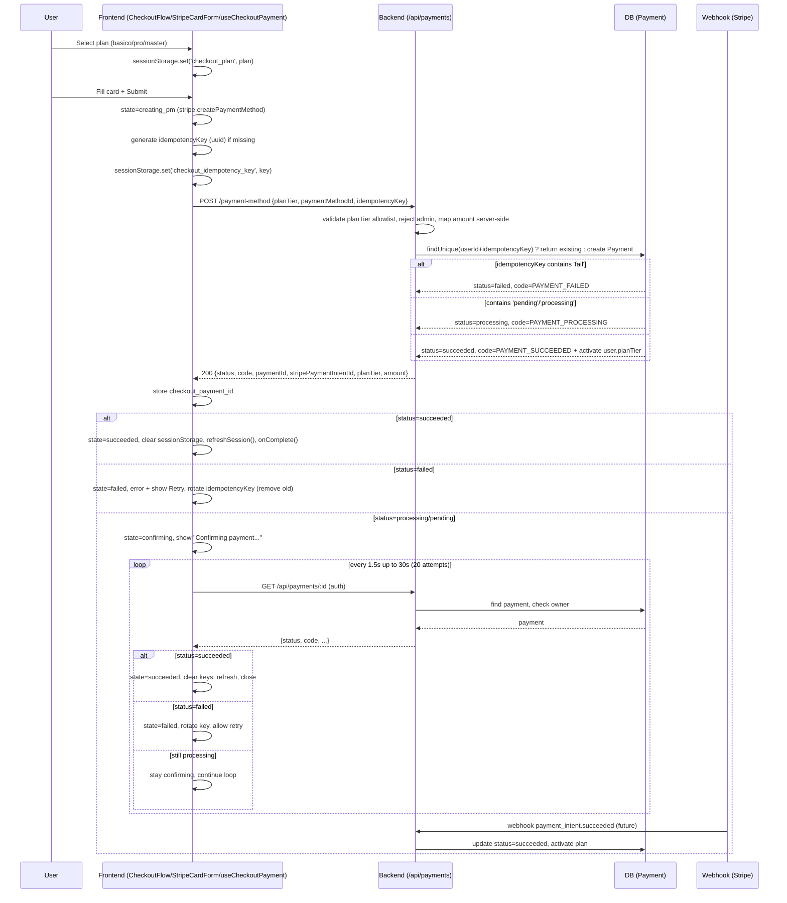

# Checkout — Strict Contract

Strict checkout contract for Teclia Academia: backend returns explicit status + machine-readable code; frontend treats **only `succeeded` as success**.

## Contract

### Backend

- `POST /api/payments/payment-method` → `{ status, code, paymentId, stripePaymentIntentId, planTier, amount, currency, clientMessage? }`
  - `status`: `succeeded | processing | pending | failed`
  - `code`: `PAYMENT_SUCCEEDED | PAYMENT_PROCESSING | PAYMENT_PENDING | PAYMENT_FAILED | INVALID_PLAN_TIER | ADMIN_PURCHASE_FORBIDDEN | VALIDATION_ERROR`
  - Validates `planTier` against allowlist `['basico','pro','master']` (rejects `free` or unknown).
  - Rejects admin role (`403 ADMIN_PURCHASE_FORBIDDEN`).
  - Amount comes from server map (`PLAN_AMOUNTS = { basico:999, pro:2499, master:4999 }` cents, `usd`), never trusts client amount.
  - Requires `idempotencyKey` (≥8 chars) scoped to `userId` (`@@unique([userId, idempotencyKey])`). Same key returns same payment (idempotent).
  - On `succeeded` immediately activates entitlements (`user.planTier = planTier`). On `processing/pending` activation is deferred to webhook/polling confirmation.
- `GET /api/payments/:id` (auth, owner-only)
  - Returns same shape. `403 UNAUTHORIZED` if not owner, `404 PAYMENT_NOT_FOUND` if missing.
  - Used for polling every **1.5s up to ~30s** (max 20 attempts).

### Status Handling

| Status | Terminal? | Code | UI |
|--------|-----------|------|----|
| `succeeded` | yes | `PAYMENT_SUCCEEDED` | Success → clear session keys, refresh entitlements, close modal/navigate |
| `failed` | yes | `PAYMENT_FAILED` | Error + allow retry **with new idempotency key** (old key rotated) |
| `processing` / `pending` | no | `PAYMENT_PROCESSING/PENDING` | `confirming` → `Confirming payment…` + polling |

**Invariant:** UI success is impossible when `status !== 'succeeded'`. Hook never calls `onSuccess` for non-terminal states.

### Frontend

- Hook `useCheckoutPayment` in `src/hooks/useCheckoutPayment.js`
  - States: `idle | creating_pm | submitting | confirming | succeeded | failed`
  - `submit({ planTier, paymentMethodId, idempotencyKey })` → `creating_pm` → `submitting` → if `succeeded` → `succeeded`; if `failed` → `failed` + rotate key; if `processing/pending` → `confirming` + `setInterval(GET /api/payments/:id, 1500ms)` until terminal or 30s timeout.
  - Double-submit disabled via `isSubmitting` guard.
  - `aria-live="polite"` for status, `aria-busy` on submit button.
  - After `succeeded`: clears `sessionStorage` keys (`checkout_plan`, `checkout_idempotency_key`, `checkout_payment_id`), calls `refreshSession()` (entitlements), invokes `onComplete`.

- Component `StripeCardForm.jsx`
  - Creates PaymentMethod client-side (mocked `pm_mock_*`; real Stripe `stripe.createPaymentMethod` would be here, PCI: **no PAN in app payloads**).
  - Delegates to hook; only `succeeded` clears card inputs.
  - i18n via `t()` from `src/i18n/messages.js` (ES/EN).
  - Idempotency key persisted in `sessionStorage`.

- `CheckoutFlow.jsx`
  - Steps: `select_plan → review → payment_method → (confirming internal) → succeeded`
  - `review` cannot be skipped without selecting a plan; `payment_method` requires authenticated user (otherwise redirect to `/auth/login?returnTo=...`).
  - Confirmation cannot be skipped: navigation to `succeeded` only via hook's terminal transition.
  - All visible strings via `t('checkout.*')`.

## Sequence Diagram



## PCI Invariant Checklist (manual, PR)

- [ ] No `cardNumber`, `PAN`, `cvc`, `expiry` in any `POST /api/payments/*` payload (only `paymentMethodId`).
- [ ] Network tab: verify request body contains only `{ planTier, paymentMethodId, idempotencyKey }` (no raw card data).
- [ ] `StripeCardForm.jsx` never logs PAN.
- [ ] Backend `paymentService.js` never reads PAN.

## i18n Keys

All checkout strings via `src/i18n/messages.js`:

```
checkout.select_plan, checkout.review, checkout.payment_method,
checkout.confirming, checkout.succeeded_title, checkout.succeeded_message {plan},
checkout.failed_title, checkout.failed_message, checkout.processing, checkout.polling,
checkout.retry, checkout.back, checkout.continue, checkout.go_to_pay, checkout.simulate_pay,
checkout.card_number, checkout.expiry, checkout.cvc, checkout.plan, checkout.price,
checkout.currency, checkout.user, checkout.mock_badge, checkout.mock_note,
checkout.success_polling_note, checkout.error_admin_forbidden, checkout.error_invalid_plan,
checkout.error_generic, checkout.creating_pm, checkout.submitting, etc.
```

Supports `es` (default) and `en` via `t(key, params, locale)` / `detectLocale()`.

## Idempotency & Retry

- Same `idempotencyKey` + `userId` → same `paymentId` (idempotent).
- After `failed`, frontend **removes** old key from `sessionStorage` and generates a new UUID on retry (`generateIdempotencyKey()`), per spec "rotate after terminal failure".
- Backend `GET` is owner-only → tested that user B gets `403 UNAUTHORIZED` when fetching user A's payment.

## Files

| File | Role |
|------|------|
| `Backend/prisma/schema.prisma` | `Payment` model |
| `Backend/constants/payments.js` | Allowlist, amounts, statuses, codes |
| `Backend/services/paymentService.js` | Server-side amount map, idempotency, plan validation, owner check |
| `Backend/controllers/paymentController.js` | HTTP handlers |
| `Backend/schemas/payment.schema.js` | Zod validation |
| `Backend/routes/payments.js` | `/payment-method` + `/:id` routes |
| `Backend/app.js` | Mount `/api/payments` |
| `src/i18n/messages.js` | ES/EN messages + `t()` |
| `src/hooks/useCheckoutPayment.js` | Strict state machine + polling (1.5s×20) |
| `src/services/api.js` | `paymentsService` + `generateIdempotencyKey` |
| `src/components/payments/StripeCardForm.jsx` | PCI-safe form, hook wiring, a11y |
| `src/components/payments/CheckoutFlow.jsx` | Step guard, i18n, session keys, refresh |
| `Backend/tests/payments.test.js` | Contract + authz + idempotency tests |
| `docs/checkout.md` | This doc |

## Acceptance Criteria Mapping

- UI success impossible when `status !== succeeded` → hook only calls `onSuccess` on `succeeded`; `StripeCardForm` only shows success message after `succeeded`.
- Polling endpoint authz → `GET /api/payments/:id` checks `payment.userId !== req.user.id` → `403`.
- Idempotency rotated after failure → hook `handleTerminalFailure` removes `checkout_idempotency_key`; `StripeCardForm.handleRetry` generates new UUID; test verifies same key returns same failed payment, new key creates new succeeded payment.
- i18n ES/EN → `src/i18n/messages.js` with both locales.
- Docs updated → this file with mermaid.

## Security Hardening (audit 2026-08-27)

- **Mock guards**: `paymentService.determineMockStatus()` only honors `fail/pending` hints and auto-`succeeded` outside production (`NODE_ENV !== production` or `STRIPE_MOCK_ENABLED=true` / `ALLOW_TEST_KEY_HINTS`). In `production` without `STRIPE_MOCK_ENABLED`, all new payments start `processing` requiring webhook. Prevents bypass via crafted `idempotencyKey`.
- **Race handling**: `createPayment` catches `P2002` unique violation and returns existing idempotent record.
- **Input validation**: `payment.schema.js` enforces `planTier` trim+lowercase, `idempotencyKey` 8-128 chars `^[A-Za-z0-9_\-:.]+$`, `paymentMethodId` `^pm(_mock)?_[A-Za-z0-9_]+$` max 100. Service double-validates defense-in-depth.
- **Rate limiting**: `paymentLimiter` (20/15m) on both routes (`routes/payments.js:9-10`) + `globalLimiter`.
- **Error sanitization**: Controllers return `Internal server error` on 500, log details server-side only.
- **CORS**: `app.js:22-30` respects `FRONTEND_URL/CORS_ORIGINS` env, otherwise mirrors origin (dev). Helmet CSP disabled for Vite, HSTS via helmet defaults.
- **JWT**: warns if default secret in production (`app.js:18`).
- **Amount tampering**: Controller logs `amount` from client and ignores it, server map authoritative.
- **ID param**: `GET /:id` validates `/^\d+$/` max 10 chars before `Number()`.
- **Double submit**: Hook uses `isSubmittingRef` + `status` guard (`useCheckoutPayment.js:138-145`) and clears on terminal/timeout.
- **Polling timeout**: After 20 attempts (30s) transitions to `failed` `PAYMENT_TIMEOUT` instead of lingering `confirming`.
- **XSS**: `t()` prototype-pollution guard (`messages.js:95`), React escapes all `payment.clientMessage`/plan usage. `getNested` checks `__proto__`.
- **SessionStorage**: All `sessionStorage` access wrapped in `try/catch` (`CheckoutFlow.jsx`, `LandingPage.jsx`, hook) for private-mode/SSR safety; plan normalized via allowlist before rendering.
- **PCI**: `StripeCardForm` never sends PAN (`pm_mock_*` only), clears card state on success/unmount (`StripeCardForm.jsx:20,43`).
- **CSRF**: Duplicate header removed; Bearer JWT not cookie-based so CSRF risk low, header kept only for non-GET where needed (`services/api.js:18-32`).
